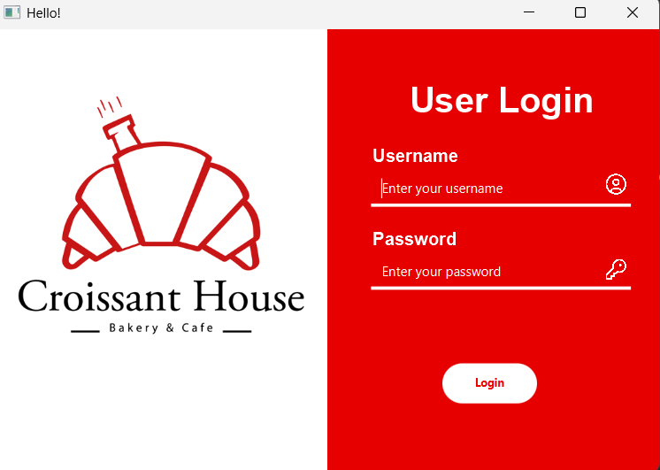
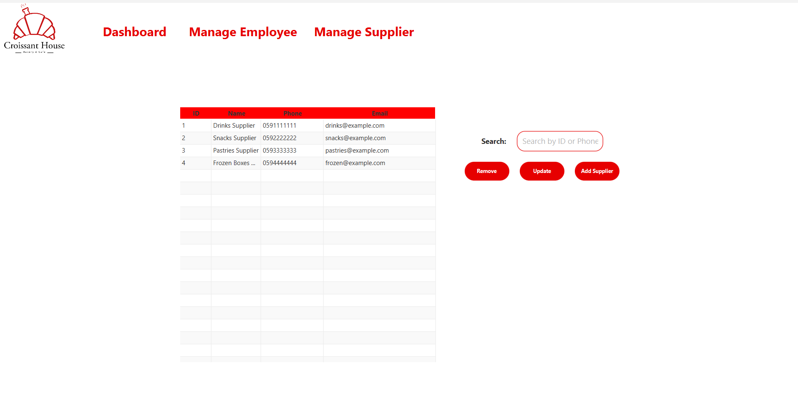

# 🥐 Croissant House Cache Board & Management System

A JavaFX desktop application for managing the daily operations of a bakery business — from billing and order tracking to sales statistics and supplier management. Built for both employees and managers, this system integrates **live database synchronization** and custom-built data structures for a smooth and responsive experience.

## 🧰 Tech Stack

- **Language**: Java  
- **UI**: JavaFX  
- **Database**: SQL (connected via external Java DB library)  
- **Data Structures**: Custom-built **Linked List**  
- **App Type**: Desktop (multi-role: employee & manager)

## 👥 Roles & Dashboards

- **Employee Dashboard (Caching Board)**  
  - Handles real-time billing
  - Goods categorized for easy selection
  - Automatic total calculation on orders
  - Access to customer order history

- **Manager Dashboard (Admin Panel)**  
  - View sales and employee statistics
  - Manage suppliers
  - Access full historical data and analytics

## 📦 Core Features

- **Login System**  
  Distinguishes between employee and manager roles and redirects accordingly.

- **Billing System**  
  - Goods displayed by category  
  - Add items to an active bill  
  - Auto-updating totals

- **Live Database Connection**  
  - Changes made in the app (orders, history, suppliers, etc.) are reflected **immediately** in the database.

- **Order & Customer History**  
  Track previous orders and customer activity for better service.

- **Sales Statistics & Supplier Management** *(Manager Only)*  
  Managers can analyze business performance and manage backend operations.

- **Custom Linked List**  
  Used internally for managing live in-app data such as bills, inventory, or history before syncing to DB.

## 📸 Screenshots
  
  
![screen shot](assets/3.png
  

  

 

## ⚙️ How to Run

1. Clone the repo:
   ```bash
   git clone https://github.com/yourusername/croissant-house-system.git
